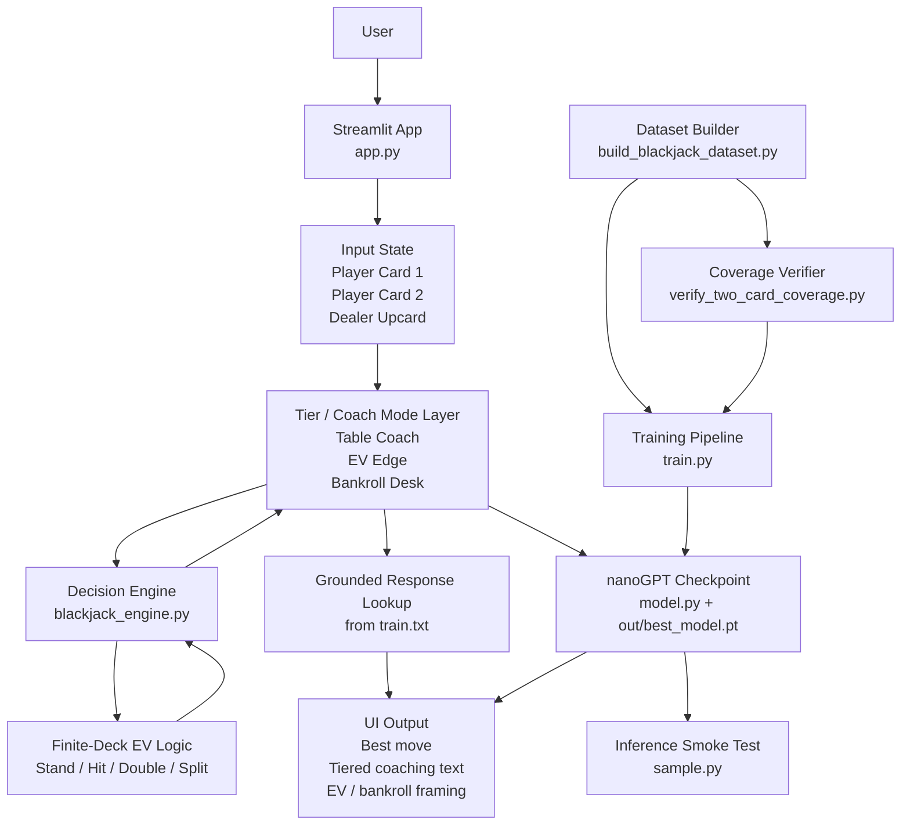
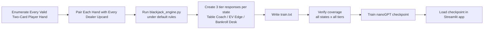

# System Design

This document shows the current high-level architecture of the Blackjack AI Coach MVP, including where the model sits, how data moves through the system, and how the narrowed two-card training phase is organized.

## High-Level Architecture



## Two-Card Training Flowchart



## ASCII Diagram

```text
User
  |
  v
Streamlit UI (app.py)
  |
  +--> Input scope for current phase
  |       - Player Card 1
  |       - Player Card 2
  |       - Dealer Upcard
  |
  +--> Membership Tier / Coach Mode Logic
          |
          v
      Decision Engine (blackjack_engine.py)
          |
          v
      Finite-deck EV evaluation
      - Stand
      - Hit
      - Double
      - Split
          |
          v
      Structured result
      - recommended action
      - EV values
      - margin
      - coaching payload
          |
          +--> Grounded lookup from train.txt
          |
          +--> Optional nanoGPT checkpoint output
                  |
                  v
              model.py / out/best_model.pt
  |
  v
Rendered UI response
```

## Where The Model Sits

There are two different "model" layers in this MVP:

1. Decision model:
   `blackjack_engine.py`
   This is the core recommendation engine. It evaluates the user hand, dealer upcard, and rules, then computes the expected value of legal actions. This is the model that actually drives the recommendation.

2. Language model:
   `model.py` with `train.py`, `sample.py`, and checkpoint files in `out/`
   This nanoGPT-style model is explanation-only. It does not decide the move. Instead, it supports tiered coaching language after the decision engine has already chosen the action.

## Data Flow

1. The user enters:
   - two player cards
   - dealer upcard
   - bankroll and bet size for elite mode
   - coach mode / membership tier

2. `app.py` collects that input and sends the blackjack state to `recommend_action()` in `blackjack_engine.py`.

3. `blackjack_engine.py`:
   - normalizes card input
   - evaluates the hand
   - computes finite-deck EV values for legal actions
   - selects the highest-value action
   - returns structured output including EVs, explanation, and coaching payload

4. `app.py` formats the response based on tier:
   - `Table Coach`: simplified coaching
   - `EV Edge`: EV comparison and financial reasoning
   - `Bankroll Desk`: bankroll-aware analysis using bankroll size and current bet

5. If a grounded response exists in `train.txt`, the app can retrieve it directly for the matching hand and tier.

6. If needed, the trained checkpoint can be used as an explanation layer on top of that grounded response path.

7. The final response is rendered back into the Streamlit interface.

## Training / Offline Flow

The training side of the repo is separate from the live recommendation path:

1. `build_blackjack_dataset.py` generates the current two-card-only dataset:
   - every valid two-card player hand
   - every dealer upcard
   - every tier response

2. `verify_two_card_coverage.py` checks that all two-card hand and tier combinations are present, parseable, encodable, and readable.

3. `train.py` trains the nanoGPT-style model on that verified dataset.

4. `sample.py` tests the trained model on a known two-card prompt.

5. The trained checkpoint can be used by `app.py` as an explanation layer.

## Main Files

- `app.py`: Streamlit interface and tiered presentation logic
- `blackjack_engine.py`: decision engine and EV computation
- `build_blackjack_dataset.py`: two-card training data generation
- `verify_two_card_coverage.py`: exhaustive two-card coverage verification
- `train.py`: model training
- `model.py`: nanoGPT-style model definition
- `sample.py`: checkpoint inference test
