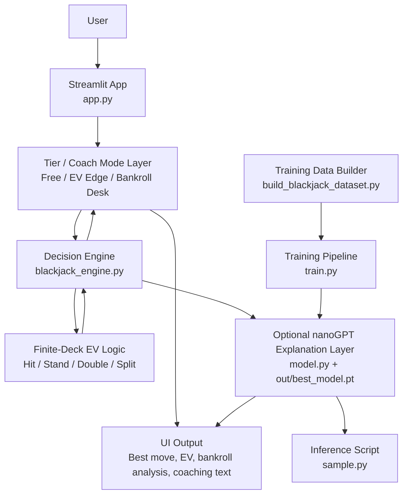

# System Design

This document shows the high-level architecture of the Blackjack AI Coach MVP, including where the model sits and how data moves through the system.

## High-Level Architecture



## ASCII Diagram

```text
User
  |
  v
Streamlit UI (app.py)
  |
  +--> Membership Tier / Coach Mode Logic
  |       |
  |       v
  |   Decision Engine (blackjack_engine.py)
  |       |
  |       v
  |   Finite-deck EV evaluation
  |   - Stand
  |   - Hit
  |   - Double
  |   - Split
  |       |
  |       v
  |   Structured result
  |   - recommended action
  |   - EV values
  |   - margin
  |   - coaching payload
  |       |
  |       +--> Bankroll Desk analysis
  |       |
  |       +--> Optional nanoGPT explanation
  |               |
  |               v
  |           model.py / trained checkpoint
  |
  v
Rendered UI response
```

## Where The Model Sits

There are two different "model" layers in this MVP:

1. Decision model:
   `blackjack_engine.py`
   This is the core recommendation engine. It evaluates the user hand, dealer upcard, and rules, then computes the expected value of legal actions. This is the model that actually drives the recommendation.

2. Language model:
   `model.py` with `train.py`, `sample.py`, and optional checkpoint files in `out/`
   This nanoGPT-style model is optional. It does not decide the move. Instead, it can generate additional natural-language explanation text after the decision engine has already chosen the action.

## Data Flow

1. The user enters:
   - player cards
   - dealer upcard
   - optional extra cards
   - bankroll and bet size for elite mode
   - coach mode / membership tier

2. `app.py` collects that input and sends the blackjack state to `recommend_action()` in `blackjack_engine.py`.

3. `blackjack_engine.py`:
   - normalizes card input
   - evaluates the hand
   - computes finite-deck EV values for legal actions
   - selects the highest-value action
   - returns structured output including EVs, explanation, and coaching payload

4. `app.py` formats the response based on tier:
   - `Table Coach`: simplified coaching
   - `EV Edge`: EV comparison and financial reasoning
   - `Bankroll Desk`: bankroll-aware analysis using bankroll size and current bet

5. If a trained checkpoint exists, `app.py` can also call the optional nanoGPT layer to generate extra explanation text.

6. The final response is rendered back into the Streamlit interface.

## Training / Offline Flow

The training side of the repo is separate from the live recommendation path:

1. `build_blackjack_dataset.py` generates synthetic blackjack examples.
2. `train.py` trains the nanoGPT-style model on that dataset.
3. `sample.py` tests the trained model.
4. The trained checkpoint can be used by `app.py` as an optional explanation layer.

## Main Files

- `app.py`: Streamlit interface and tiered presentation logic
- `blackjack_engine.py`: decision engine and EV computation
- `build_blackjack_dataset.py`: synthetic training data generation
- `train.py`: model training
- `model.py`: nanoGPT-style model definition
- `sample.py`: checkpoint inference test

